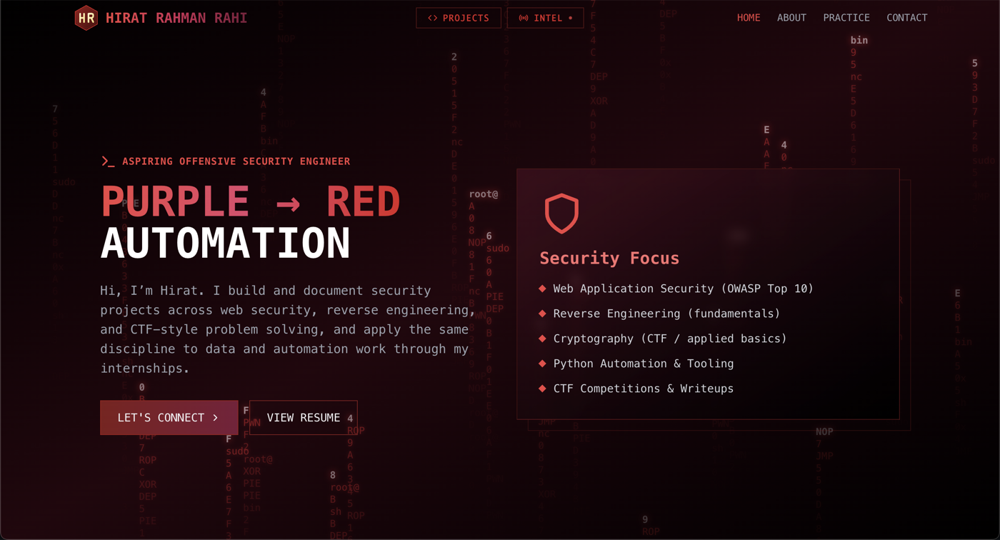

# Hirat Rahman Rahi, Portfolio

Personal site and project showcase for Hirat Rahman Rahi, a Computer Science and Neuroscience student at Illinois Wesleyan University focused on offensive security, automation, and applied AI tooling.

**Live site:** [hiratrahi.com](https://hiratrahi.com)



---

## About This Project

This repository is the source for my personal portfolio: a React single-page application deployed on Cloudflare Pages. Beyond the standard "about me" layout, it includes a couple of functional tools built on Cloudflare Pages Functions, namely a live security threat intelligence feed and a project showcase with detailed case studies.

The goal was to build something that reads less like a template and more like a working piece of software: real API integrations, a documented security posture, and content that reflects actual projects and experience rather than placeholder copy.

## Pages and Features

| Page | Route | What it does |
|---|---|---|
| **Home** | `/` | Hero, about, skills, experience/leadership timeline, and contact sections |
| **Projects** | `/projects` | Case studies for shipped work, including REDHEXX, TuitionCreep, and SpecterAI, with tech stacks and links |
| **Intel** | `/intel` | Live security intelligence dashboard, see below |
| **Scan** | `/scan` | A small easter egg landing page for a QR code on my resume/business card |

### Live Threat Intelligence Feed (`/intel`)

The Intel page pulls from two independent, live security data sources through Cloudflare Pages Functions:

- **NVD Threat Feed:** recently published CVEs pulled from the National Vulnerability Database (NIST), for general vulnerability awareness.
- **CISA Known Exploited Vulnerabilities (KEV):** vulnerabilities CISA has confirmed are being actively exploited in the wild, which is a stricter and more urgent signal than "just disclosed."
- **Security News:** a rolling feed of current cybersecurity headlines.

These are served through backend functions (`functions/api/cves.js`, `functions/api/kev.js`, `functions/api/news.js`) rather than called directly from the client, which keeps API keys off the frontend.

## Tech Stack

**Frontend**
- React 18
- React Router 7
- Tailwind CSS (custom burgundy/red theme)
- Lucide React (icons)

**Backend / Infrastructure**
- Cloudflare Pages (hosting)
- Cloudflare Pages Functions (serverless API routes for CVE, KEV, and news data)

## Security Posture

Since this is a cybersecurity-focused portfolio, the site's own security hygiene matters. Notable measures in place:

- Content Security Policy, HSTS, `X-Content-Type-Options`, `X-Frame-Options`, `Referrer-Policy`, and a restrictive `Permissions-Policy`, all defined in [`public/_headers`](public/_headers)
- A published [`security.txt`](public/.well-known/security.txt) at `/.well-known/security.txt` (RFC 9116) for responsible disclosure
- No plaintext credentials or secrets in client-side code; third-party API calls are proxied through Pages Functions
- An internal audit trail documenting findings and remediations lives in [`SECURITY_AUDIT_v2.md`](SECURITY_AUDIT_v2.md)

## Project Structure

```
hr-portfolio/
├── public/
│   ├── .well-known/security.txt
│   ├── _headers                 # Security headers config
│   ├── robots.txt
│   └── sitemap.xml
├── functions/
│   └── api/
│       ├── cves.js              # NVD CVE feed proxy
│       ├── kev.js                # CISA KEV feed proxy
│       └── news.js               # Security news feed proxy
├── src/
│   ├── App.js                    # Home page: hero, about, skills, experience, contact
│   ├── components/
│   │   ├── ProjectsPage.js       # /projects
│   │   ├── ThreatFeedPage.js     # /intel (NVD feed + layout)
│   │   ├── KevSection.js         # CISA KEV section within /intel
│   │   ├── NewsSection.js        # Security news section within /intel
│   │   ├── QRLandingPage.js      # /scan
│   │   ├── CertTracker.js        # Certification/practice-platform progress
│   │   └── ErrorBoundary.js
│   ├── data/
│   │   └── portfolio.js          # Experience, leadership, and skills content
│   └── utils/
├── docs/
│   └── screenshots/
└── package.json
```

## Getting Started

**Requirements:** Node 20.x (see `.nvmrc`)

```bash
# Install dependencies
npm install

# Start the local dev server
npm start

# Production build
npm run build
```

Note: the live data feeds (`/api/cves`, `/api/kev`, `/api/news`) run as Cloudflare Pages Functions and are only available on a deployed environment (or via `wrangler pages dev`), not the plain `react-scripts` dev server.

## Deployment

The site deploys to Cloudflare Pages. Production builds run through `npm run build`, and the `functions/` directory is picked up automatically as Pages Functions.

## Contact

- **Email:** hrahi@iwu.edu
- **LinkedIn:** [linkedin.com/in/hiratrahman](https://linkedin.com/in/hiratrahi)
- **GitHub:** [github.com/hiratinspace](https://github.com/hiratinspace)

## License

All rights reserved. Feel free to use this project as a reference or inspiration for your own portfolio, but please do not copy it directly.
